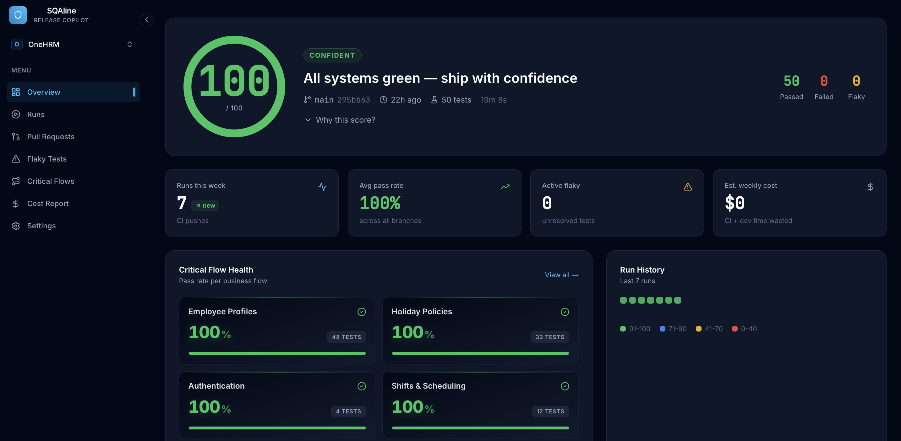

# Playwright Automation Framework


A production-ready Playwright automation framework with Page Object Model, Smart Page Objects, role-based testing, and CI/CD integration — built and battle-tested on a live enterprise HRM system.

---

## ✅ Proven in Production

This framework is not a demo. It powers the live test suite for **OneHRM** — an enterprise HR management system handling payroll, salary deductions, and employee financial records for real organisations.

| Metric | Result |
|---|---|
| E2E tests automated | **50 tests** |
| Pass rate (all branches) | **100%** |
| Full CI pipeline runtime | **~17 minutes** |
| Flaky tests | **0** |
| Release confidence score | **100 / 100 (SQAline)** |
| Estimated CI waste per week | **$0** |
| Manual QA cycle eliminated | **2 weeks → fully automated** |

Before this framework, every release required 2 weeks of manual regression testing — and bugs still reached production. Now every push to `main` is validated in under 17 minutes with a verified confidence score before any release decision is made.

> 📊 [View live SQAline dashboard →](https://sqaline.com) — real-time release confidence per commit

---

## 🛡️ Business Risk Coverage

Tests are designed around business risk — not technical coverage metrics. Every critical flow that could cost the business money, trust, or compliance is protected first.

| Business Risk Area | What's Protected | Risk Level | Status |
|---|---|---|---|
| Payroll & Salary | Additions, deductions, salary setup, loans, overtime, e-wallet | 🔴 Critical | ✅ Covered |
| Access Control | Role creation, permission assignment, role-to-employee mapping | 🔴 Critical | ✅ Covered |
| Authentication | Login flows, session handling, credential validation | 🔴 Critical | ✅ Covered |
| Employee Records | Profile creation, documents, dependants, qualifications, bank accounts | 🟠 High | ✅ Covered |
| Org Structure | Company, branch, department, designation, company policy | 🟠 High | ✅ Covered |
| Leave & Attendance | Holiday calendars, holiday entries, office shift management | 🟡 Medium | ✅ Covered |
| Internal Comms | Announcements — create, edit, delete | 🟡 Medium | ✅ Covered |
| API Layer | Backend validation, response integrity, schema checking | 🟠 High | 🔄 Phase 2 |
| Visual Regression | UI consistency across deployments and browsers | 🟡 Medium | 📋 Phase 3 |
| Performance Benchmarks | Page load thresholds, response time gates | 🟡 Medium | 📋 Phase 4 |


*100/100 release confidence · 50 tests · 0 flaky · Built with [SQAline](https://app.sqaline.com)*

---

## 🗺️ Roadmap

This framework is actively maintained and expanding. Each phase follows the same principle: protect the highest business risk areas first.

### ✅ Phase 1 — Core HR Flows (Complete)
- 50 E2E tests covering payroll, employee management, org structure, access control, and leave management
- GitHub Actions CI pipeline running on every push to `main`
- SQAline integration delivering a 100/100 confidence score
- Zero flaky tests, zero failed runs in production

### 🔄 Phase 2 — API Layer & Extended Payroll (In Progress)
- Salary computation validation against expected outputs
- API response integrity and schema checking
- Multi-role test scenarios (admin vs employee vs manager)
- Cross-browser coverage: Firefox and WebKit alongside Chromium

### 📋 Phase 3 — Visual Regression & Accessibility (Planned)
- Pixel-by-pixel UI regression on critical pages
- Baseline management for intentional UI updates
- Mobile viewport coverage
- Accessibility checks on core flows

### 📋 Phase 4 — Full Release Intelligence (Planned)
- PR-level confidence scores before merge
- Automated release gates blocking deploys below threshold
- Flaky test trend analysis and auto-retry logic
- Team-wide SQAline reporting dashboard

---

## 🚀 Quick Start

### Create a New Project

```bash
# Step 1: Copy this entire directory to your new project
cp -r /path/to/automation-framework /path/to/my-new-automation

# Step 2: Navigate to your new project
cd /path/to/my-new-automation

# Step 3: Install dependencies
npm install

# Step 4: Install Playwright browsers
npx playwright install

# Step 5: Configure environment
cp .env.example .env
# Edit .env with your application URL and credentials

# Step 6: Start writing tests
# Create your page objects in pages/
# Write your tests in tests/
```

### Run Tests

```bash
# Run all tests
npm test

# Run framework verification tests
npm test tests/framework-verification.spec.ts

# Run with UI mode
npm run test:ui

# Run in headed mode
npm run test:headed

# Run in debug mode
npm run test:debug

# View HTML test report
npm run test:report

# Record new tests with codegen
npm run test:codegen
```

---

## ✨ Features

### Built-in Reliability
- **Flaky Test Tracking** — automatically identifies unstable tests across runs and generates fix suggestions
- **Built-in Retries** — configurable retry mechanism for transient failures
- **Trace Recording** — automatic trace capture on first retry for debugging
- **Video Recording** — captures full video of test failures for review

### Page Object Model
- **BasePage** — 50+ utility methods covering navigation, interaction, assertions, waits, and API mocking
- **SmartPageObject** — auto-healing selectors with multi-selector fallback chains; built for dynamic and evolving UIs
- **Role-Based Fixtures** — pre-authenticated test contexts per user role with reusable login/logout logic

### API Testing Layer
- **Type-Safe API Client** — clean wrapper around Playwright's request API
- **Error Handling** — automatic validation with detailed, actionable error messages
- **Response Validation** — schema checking and type safety on every response
- **Authentication Support** — Bearer token and API key handling out of the box

### Visual Regression Testing
- **Pixel-by-Pixel Comparison** — detects unintended UI changes before they reach users
- **Baseline Management** — simple baseline updates when UI changes intentionally
- **Configurable Thresholds** — adjustable sensitivity per component or page

### CI/CD Integration
- **GitHub Actions** — ready-to-use workflow, no configuration required
- **Multi-Browser Matrix** — test on Chromium, Firefox, and WebKit
- **SQAline Integration** — confidence score per commit, not just raw pass/fail logs
- **Artifact Upload** — automatic upload of test results and screenshots on failure

---

## 📁 Structure

```
automation-framework/
├── pages/
│   ├── BasePage.ts               # Core utilities (50+ methods)
│   ├── SmartPageObject.ts        # Auto-healing page objects
│   ├── configs/                  # Field configuration templates
│   └── examples/                 # Example page objects
├── utils/
│   ├── test-data.ts              # Test data generation
│   ├── test-results-parser.ts    # Result parsing and formatting
│   ├── llm-summarizer.ts         # AI-powered test summaries (optional)
│   ├── api-client.ts             # Type-safe API testing layer
│   ├── flaky-tracker.ts          # Flaky test detection and reporting
│   ├── visual-comparator.ts      # Visual regression testing
│   └── types.ts                  # Shared type definitions
├── fixtures/
│   └── base-fixtures.ts          # Role-based fixture patterns
├── tests/
│   ├── examples/                 # Example tests (copy and customise)
│   └── framework-verification.spec.ts  # Framework health checks
├── docs/
│   ├── FRAMEWORK_GUIDE.md        # Architecture and core concepts
│   ├── PATTERN_GUIDE.md          # Coding patterns and best practices
│   └── UPDATE_GUIDE.md           # How to update without breaking tests
├── .github/
│   └── workflows/
│       └── test.yml              # GitHub Actions CI workflow
├── playwright.config.ts
├── .env.example
└── README.md
```

---

## 🔧 Usage

### Create a Page Object

```typescript
import { Page } from '@playwright/test';
import { BasePage } from './BasePage';

export class LoginPage extends BasePage {
  private readonly emailInput = 'input[name="email"]';
  private readonly passwordInput = 'input[name="password"]';
  private readonly loginButton = 'button[type="submit"]';

  async login(email: string, password: string) {
    await this.fill(this.emailInput, email);
    await this.fill(this.passwordInput, password);
    await this.click(this.loginButton);
  }
}
```

### SmartPageObject — Auto-Healing Selectors

```typescript
import { SmartPageObject, FieldConfig } from './SmartPageObject';

export class FormPage extends SmartPageObject {
  private readonly fields: Record<string, FieldConfig> = {
    email: {
      name: 'Email',
      selectors: [
        'input[name="email"]',
        'input[type="email"]',
        '[data-testid="email"]'
      ],
      required: true,
      type: 'text'
    }
  };

  async fillForm(data: any) {
    await this.smartFill(this.fields.email, data.email);
  }
}
```

### Role-Based Fixtures

```typescript
import { test as base } from '@playwright/test';

export const testAsAdmin = base.extend({
  page: async ({ browser }, use) => {
    const context = await browser.newContext();
    const page = await context.newPage();
    await loginAsAdmin(page);
    await use(page);
    await context.close();
  }
});

testAsAdmin('admin can access settings', async ({ page }) => {
  // Runs as a fully authenticated admin — no login steps needed
});
```

### Flaky Test Tracking

```typescript
import { flakyTracker } from './utils/flaky-tracker';

test.beforeEach(async ({}, testInfo) => {
  flakyTracker.trackTestExecution(testInfo);
});

test.afterEach(async ({}, testInfo) => {
  if (testInfo.status === 'failed') {
    flakyTracker.recordFailure(testInfo);
  }
});

// After run: generates report with flakiness scores and fix suggestions
flakyTracker.printSummary();
flakyTracker.generateReport();
```

### API Testing

```typescript
import { APIClient } from './utils/api-client';

const api = new APIClient(page, 'https://api.example.com', {
  apiKey: process.env.API_KEY,
});

const users = await api.get('/api/users');
expect(users.data.users).toHaveLength(10);

const created = await api.post('/api/users', { name: 'John' });
expect(created.status).toBe(201);
```

### Visual Regression Testing

```typescript
import { VisualComparator } from './utils/visual-comparator';

const comparator = new VisualComparator(
  page,
  'screenshots/baseline',
  'screenshots/current',
  0.01  // 1% pixel difference threshold
);

test('dashboard has no visual regression', async ({ page }) => {
  await page.goto('/dashboard');
  await comparator.compare(page, 'dashboard');
});
```

---

## 📝 Environment Configuration

```env
# Application
QA_BASE_URL=https://your-app.example.com

# Authentication
TEST_ADMIN_EMAIL=admin@example.com
TEST_ADMIN_PASSWORD=your-password
TEST_USER_EMAIL=user@example.com
TEST_USER_PASSWORD=your-password

# Optional — AI-powered test summaries
OPENAI_API_KEY=your-key

# Optional — API testing
API_KEY=your-key
```

---

## 📊 Reporting

| Report | What It Shows | Where |
|---|---|---|
| GitHub Actions log | Raw test pass/fail per run | CI pipeline |
| Playwright HTML report | Per-test duration, traces, screenshots | `npm run test:report` |
| Flaky test report | Flakiness scores, failure patterns, fix suggestions | `reports/flaky-report.json` |
| Visual regression report | Pixel diff results per page | `screenshots/` |
| SQAline dashboard | Release confidence score, run history, trend analysis | [sqaline.com](https://sqaline.com) |

---

## 🛠️ Troubleshooting

**Tests failing randomly?**
- Check `reports/flaky-report.json` for patterns and fix suggestions
- Switch to `SmartPageObject` for auto-healing selectors
- Increase retries in `playwright.config.ts`

**Selectors not working?**
- Use `data-testid` attributes wherever the codebase allows
- Add fallback selectors in `SmartPageObject` field configs
- Run `npm run test:debug` to step through the failing test

**Framework needs updating?**
- Check `CHANGELOG.md` for breaking changes before updating
- Back up your custom files, copy new framework files, merge changes

---

## 📖 Documentation

- [Framework Guide](./docs/FRAMEWORK_GUIDE.md) — architecture, design decisions, core concepts
- [Pattern Guide](./docs/PATTERN_GUIDE.md) — coding patterns and best practices
- [Update Guide](./docs/UPDATE_GUIDE.md) — how to update the framework without breaking tests
- [Changelog](./CHANGELOG.md) — version history

---

## 👋 About

Built by **Junaid Nasir** — QA Automation Engineer specialising in Playwright, GitHub Actions CI/CD, and release confidence tooling for production systems.

This framework is the same foundation that eliminated a 2-week manual QA cycle for a live enterprise HRM system — delivering **50 automated E2E tests across every critical business flow**, a **100% pass rate**, and a **100/100 SQAline release confidence score** from the first production run.

**Open to freelance projects — Playwright automation, CI/CD setup, QA strategy:**
- 🔗 [Upwork Profile](https://www.upwork.com/freelancers/junaidnasir)
- 📊 [SQAline — Release Copilot](https://sqaline.com)
- 🐙 [GitHub](https://github.com/junaidnasir1001)

---

*Happy testing! 🚀*